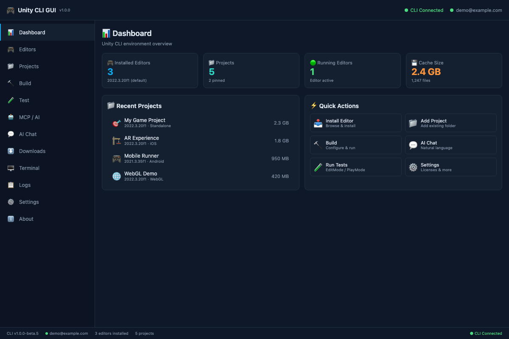
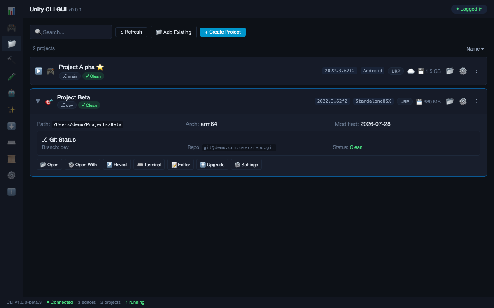
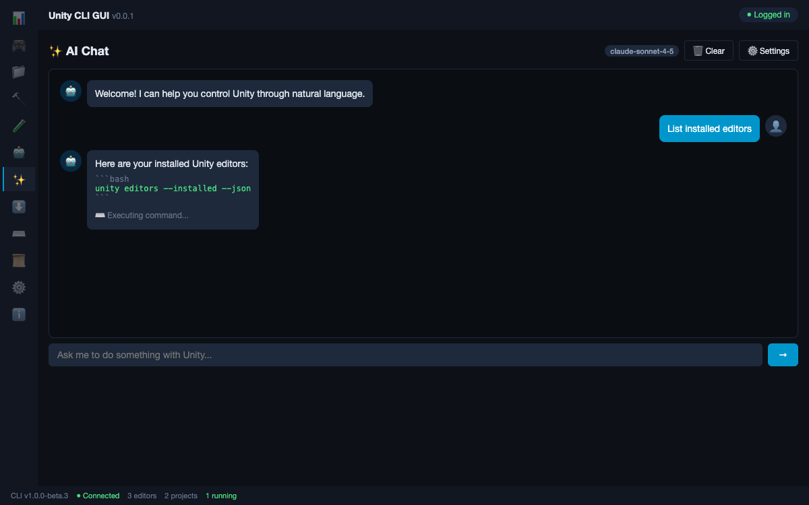
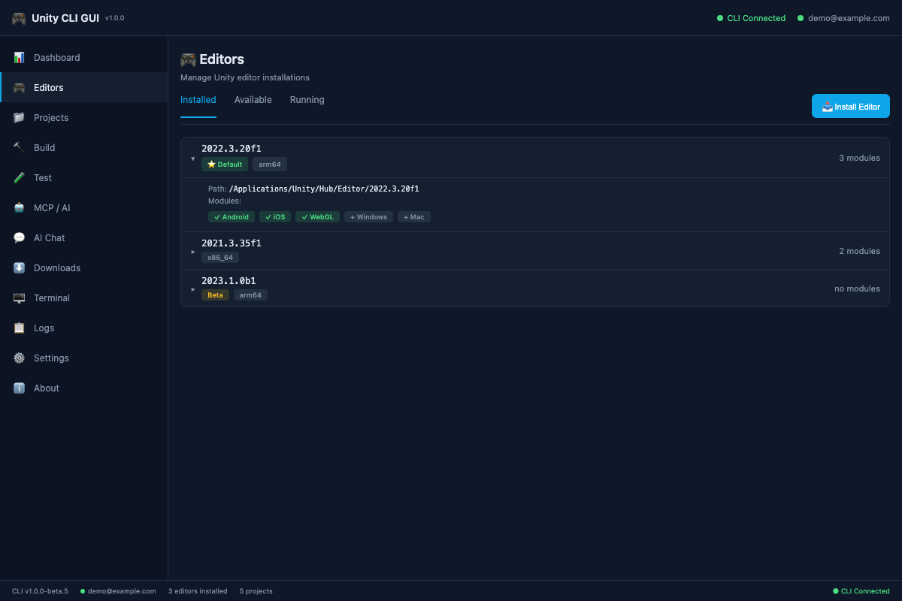
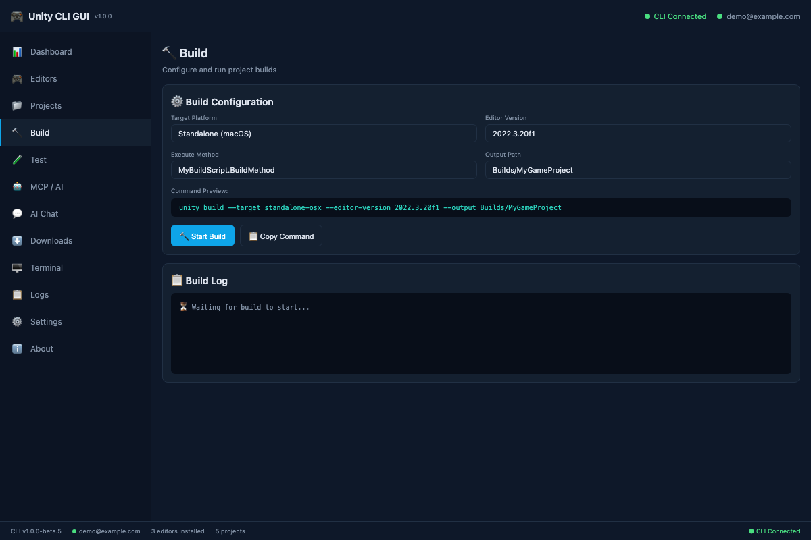
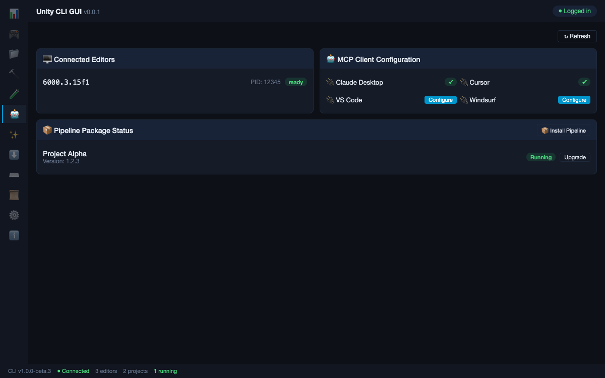
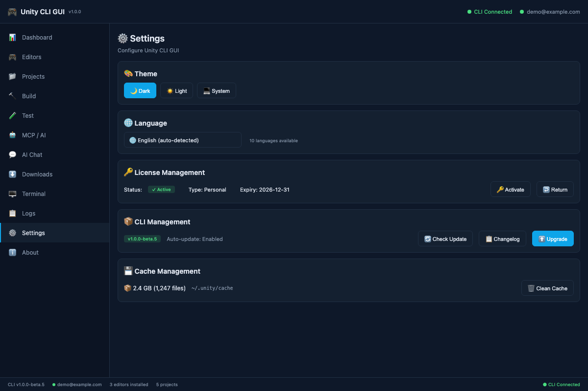

# Unity CLI GUI

A cross-platform desktop GUI for the [Unity CLI](https://discussions.unity.com/threads/unity-cli.1640035/) tool, built with **Tauri 2 + React + TypeScript**.

[中文文档](./README_zh.md) | English

## Screenshots

### Dashboard


The dashboard provides an overview of your Unity environment:
- **Installed editors count** with default version info
- **Projects count** with pinned count
- **Running editors** with live status indicator
- **Cache size** with file count
- **Recent projects** with one-click quick open shortcuts
- **Quick actions** for common tasks

### Projects Management


The projects page features:
- **Expandable card list** — click any project to expand details
- **Inline version switching** — click the version number to switch editor version directly
- **Inline target platform switching** — click the target to change build platform
- **Git info display** — branch name, repo URL, and dirty/clean status on each row
- **Project size** — displayed directly on each project card
- **Right-click context menu** — Open, Open with Parameters, Reveal in File Manager, Open in Terminal, Open in Code Editor, Copy Path, Project Settings, Check Editor, Disk Usage, Upgrade Version, Pin/Unpin, Remove from Hub
- **Search** — filter projects by name, version, or path
- **Sort** — by name, version, or modified date
- **Custom metadata** — custom names, icons (emoji/color/image), notes, and open parameters

### AI Chat


The AI Chat module allows controlling Unity through natural language:
- **4-tab settings panel**: General, Models, MCP Services, Skills
- **Custom models** — add/remove models with per-model Base URL and provider
- **Auto-save** — all settings persist automatically
- **Temperature, max tokens, context window** controls
- **Third-party MCP services** — configure via Form, JSON paste, or direct config file editing
- **Custom skills/prompts** — define reusable AI skill prompts
- **"Add via AI"** — let the AI assistant help configure MCP services and skills
- **Command auto-execution** — AI responses containing CLI commands are automatically executed with results shown inline

### Editors


Manage Unity editor installations:
- **Installed editors** list with version, architecture, modules, and path
- **Available releases** with LTS filter and stream filter
- **Running editors** with live port/PID/project status
- **Install dialog** with version, architecture, and module selection
- **Module management** — add/remove modules per editor
- **Upgrade detection** — shows available patch upgrades

### Build & Test


Configure and run project builds and tests:
- **Build configuration** with all CLI options (target, execute method, output path, Android options, versioning)
- **Live log streaming** with search filter and pause/resume
- **Test configuration** for EditMode/PlayMode tests
- **Command preview** — see the equivalent CLI command before executing

### MCP / AI Integration


Configure AI agent clients and monitor Pipeline:
- **Connected editors** with live status
- **MCP client configuration** for 15+ AI clients (Claude, Cursor, VS Code, Codex, etc.)
- **Pipeline package status** with install/upgrade actions
- **Custom commands** browser and executor

### Settings


Comprehensive settings including:
- **License management** — activate (Personal/Serial/Floating), return, status
- **Theme** — Dark/Light/System
- **Language** — 10 languages with real-time switching
- **Proxy configuration**
- **Editor install path** with file picker
- **Cache management** with clean button
- **CLI management** — check updates, upgrade, view changelog
- **Hub detection** — install/uninstall Unity Hub
- **Diagnostics** — doctor and diagnose reports

## Features

### Core
- **12 pages**: Dashboard, Editors, Projects, Build, Test, MCP/AI, AI Chat, Downloads, Terminal, Logs, Settings, About
- **50+ Unity CLI commands** wrapped via Rust backend
- **i18n**: 10 languages (English, 简体中文, 繁體中文, 日本語, 한국어, Deutsch, Español, Français, Português, Русский) with system language detection
- **Theme**: Dark, Light, and System-follow modes

### AI Chat
- Natural language → Unity CLI command execution
- OpenAI-compatible API gateway support
- Custom models with per-model Base URL
- Third-party MCP services (Form/JSON/File editing modes)
- Custom skills/prompts
- Auto-save settings

### Project Management
- Add existing project folders via system file picker
- Custom project names, icons (emoji/color/image), and notes
- Inline version and target platform switching
- Git info display (branch, repo, dirty status)
- Project size display
- Expandable card view with full details
- Right-click context menu with 11+ actions
- Search and sort

### System Integration
- **macOS**: `⌘,` shortcut to Settings, Terminal integration
- **Windows**: `Ctrl+,` shortcut, cmd terminal integration
- **Linux**: Multi-terminal support, xdg integration
- **Code editor**: VS Code / Cursor / Zed auto-detection
- System file picker for folder selection
- Reveal in file manager (Finder/Explorer/File Manager)

## Prerequisites

- [Node.js](https://nodejs.org/) v18+ (v24 recommended)
- [pnpm](https://pnpm.io/) v9+
- [Rust](https://rustup.rs/) (stable toolchain)
- [Unity CLI](https://discussions.unity.com/threads/unity-cli.1640035/) installed and on PATH

### Platform-specific requirements

| Platform | Requirements |
|----------|-------------|
| macOS | Xcode Command Line Tools |
| Linux | `webkit2gtk-4.1`, `libgtk-3`, `libayatana-appindicator3` |
| Windows | Microsoft Visual C++ Build Tools, WebView2 |

## Getting Started

```bash
# Install dependencies
pnpm install

# Start dev server
pnpm tauri dev

# Build for production
pnpm tauri build
```

## Web Server Mode (Headless Server)

For servers without a desktop environment (e.g., remote Linux boxes, CI machines), the GUI can run as a **web server** — access it from any device's browser.

### One-Click Install

**Linux / macOS:**
```bash
curl -fsSL https://raw.githubusercontent.com/song-chaoyang/unity-cli-gui/main/scripts/install-web.sh | sudo bash
```

**Windows (PowerShell as Administrator):**
```powershell
irm https://raw.githubusercontent.com/song-chaoyang/unity-cli-gui/main/scripts/install-web.ps1 | iex
```

The script auto-detects platform (Linux/macOS/Windows) and architecture (x64/arm64):

| Step | Linux | macOS | Windows |
|------|-------|-------|---------|
| Node.js | apt/NodeSource (x64+arm64), or nvm fallback | Homebrew or .pkg installer | winget or .msi download |
| Service | systemd | launchd | Scheduled Task or NSSM |
| Install dir | `/opt/unity-gui` | `/usr/local/unity-gui` | `C:\unity-gui` |

After installation, access from any browser:

```
http://<server-ip>:8080
```

### Options

```bash
# Linux/macOS
bash install-web.sh --port 9000 --dir ~/unity-gui
bash install-web.sh --update

# Windows
powershell -File install-web.ps1 -Port 9000 -Dir "C:\unity-gui"
powershell -File install-web.ps1 -Update
```

### Service Management

**Linux (systemd):**
```bash
systemctl status  unity-gui
systemctl restart unity-gui
journalctl -u     unity-gui -f
```

**macOS (launchd):**
```bash
launchctl list          com.unity-gui
launchctl kickstart -k  com.unity-gui   # restart
launchctl unload        ~/Library/LaunchAgents/com.unity-gui.plist  # stop
tail -f /tmp/unity-gui.log
```

**Windows (Scheduled Task / NSSM):**
```powershell
Start-ScheduledTask -TaskName UnityGui
Stop-ScheduledTask  -TaskName UnityGui
# Or with NSSM: nssm start/stop/restart UnityGui
```

### Manual Install

```bash
git clone https://github.com/song-chaoyang/unity-cli-gui.git
cd unity-cli-gui
pnpm install
pnpm build:web
node web/server.mjs
```

### Options

| Option | Default | Description |
|--------|---------|-------------|
| `--port` | `8080` | HTTP port |
| `--dir` | `/opt/unity-gui` | Install directory |
| `--update` | — | Update existing installation |

### Service Management

```bash
systemctl status  unity-gui
systemctl restart unity-gui
systemctl stop    unity-gui
journalctl -u     unity-gui -f   # view logs
```

### Known Limitations (Web Mode)

- **Auth login**: `unity auth login` opens a browser for OAuth — on headless servers, run `unity auth login` directly in a terminal instead.
- **File dialogs**: Uses browser `prompt()` for server-side path input.
- **File manager / Terminal / Code editor**: Not available on headless servers (returns info message).

## Tech Stack

| Layer | Technology |
|-------|-----------|
| Desktop Framework | Tauri 2.0 |
| Web Server | Node.js (built-in `http` + SSE) |
| Frontend | React 18 + TypeScript |
| Backend | Rust (Tauri) / Node.js (Web) |
| UI | Tailwind CSS + Custom Components |
| State Management | Zustand |
| HTTP Client | reqwest (Rust) / fetch (Web) |
| Build Tool | Vite 5 |

## Architecture

```
                           ┌─────────────┐
                           │   Browser    │  (Web mode — any device)
                           └──────┬──────┘
                                  │ HTTP + SSE
┌─────────────────────────────────┴───────────────────────────┐
│                    React + TypeScript (Frontend)              │
│  Dashboard │ Editors │ Projects │ Build │ Test │ AI Chat ...  │
└───────────────────┬───────────────────────────┬──────────────┘
                    │ Tauri IPC (invoke/listen)  │ fetch/SSE
┌───────────────────┴──────────────┐ ┌──────────┴──────────────┐
│       Rust Backend (Tauri)        │ │  Node.js Server (Web)   │
│  cli_executor │ streaming_process │ │  run_unity_json │ SSE   │
│  ai_chat │ file_io │ git_info    │ │  ai_chat │ fs │ spawn   │
└───────────────────┬──────────────┘ └──────────┬──────────────┘
                    │ spawn                      │ spawn
                    └──────────┬────────────────┘
                               │
              ┌────────────────┴────────────────┐
              │     Unity CLI (`unity` binary)   │
              └─────────────────────────────────┘
```

The frontend (`tauri.ts`) is the **single source of truth** — 104 commands mapped to 18 generic primitives. Three build targets share the same frontend code via Vite aliases:

| Build | invoke() → | listen() → | open() → |
|-------|-----------|------------|---------|
| Tauri (desktop) | Rust IPC | Tauri events | Native dialog |
| uTools | preload.js | preload.js | uTools dialog |
| Web (server) | HTTP fetch | SSE EventSource | browser prompt() |

## License

MIT
