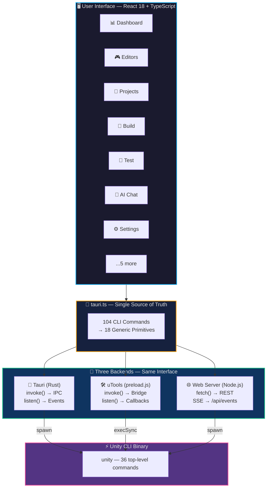
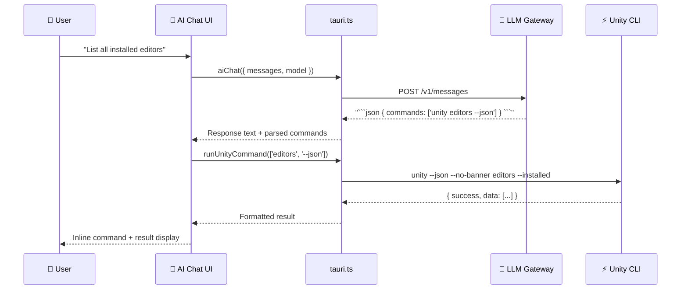
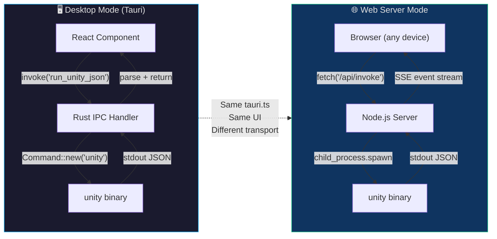
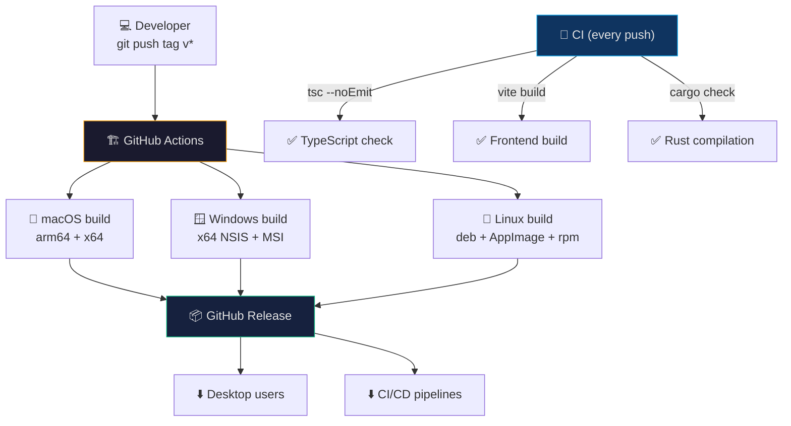

<div align="center">

# 🎮 Unity CLI GUI

### The missing visual command center for Unity development

A cross-platform desktop GUI for the [Unity CLI](https://discussions.unity.com/threads/unity-cli.1640035/) tool — manage editors, projects, builds, tests, licenses, and AI-powered automation from one beautiful app.

[](https://github.com/song-chaoyang/unity-cli-gui/actions/workflows/ci.yml)
[](https://github.com/song-chaoyang/unity-cli-gui/releases)
[](https://opensource.org/licenses/MIT)
[](https://github.com/song-chaoyang/unity-cli-gui/stargazers)
[](https://github.com/song-chaoyang/unity-cli-gui/releases)
[](https://tauri.app)
[](https://react.dev)
[](https://www.typescriptlang.org)

**macOS** · **Windows** · **Linux** · **Web Server** · **uTools**

[English](./README.md) | [中文文档](./README_zh.md)

</div>

---

## ✨ Features

### 🖥️ Twelve Built-in Pages

| Page | Description |
|:----:|-------------|
| 📊 **Dashboard** | One-glance overview — installed editors, projects, running instances, cache size, recent activity |
| 🎮 **Editors** | Install/uninstall editors, manage modules, browse releases, monitor running instances |
| 📁 **Projects** | Expandable cards with inline version/target switching, Git info, project sizes, search, sort, 13+ context menu actions |
| 🔨 **Build** | Full build configuration with live log streaming, search filter, pause/resume, command preview |
| 🧪 **Test** | EditMode/PlayMode test runner with live results and log streaming |
| 🤖 **MCP / AI** | MCP client setup for 15+ AI tools, Pipeline status, custom command browser |
| 💬 **AI Chat** | Natural language → Unity CLI execution. Custom models, MCP services, skills — 4-tab settings |
| ⬇️ **Downloads** | Track editor downloads with progress, retry, and cancel support |
| 🖥️ **Terminal** | Built-in terminal (xterm.js) with maximize mode — no external terminal needed |
| 📋 **Logs** | Unity Hub activity log viewer with follow mode, search, and filtering |
| ⚙️ **Settings** | Licenses, themes, languages, proxy, cache, CLI updates, Hub management, diagnostics |
| ℹ️ **About** | Version info, update checker, environment diagnostics, bug reporting |

### 🚀 Key Highlights

- **AI-Powered Automation** — Chat with your Unity environment in natural language. AI translates your intent into CLI commands and executes them inline
- **Three Build Targets, One Codebase** — Desktop (Tauri), Web Server (Node.js), uTools — all share the same frontend via Vite aliases
- **104 CLI Commands Wrapped** — Every Unity CLI command is accessible through a type-safe API. The frontend (`tauri.ts`) is the single source of truth, mapping 104 commands to 18 generic primitives
- **10 Languages** — English, 简体中文, 繁體中文, 日本語, 한국어, Deutsch, Español, Français, Português, Русский — with automatic system language detection
- **Dark / Light / System Themes** — Follow system preference or override manually
- **Cross-Platform** — Native builds for macOS (Apple Silicon + Intel), Windows, and Linux
- **Headless Web Server Mode** — Run on remote servers, access from any browser. One-click install script for Linux, macOS, and Windows
- **Git Integration** — Branch, repo URL, and dirty status visible on every project card
- **Context Menu Power** — 13+ right-click actions per project: Open, Open with Parameters, Reveal, Terminal, Code Editor, Copy Path, Settings, Disk Usage, Upgrade, Pin, Remove, Link/Unlink Cloud

### 🤖 AI Chat Module

Control Unity through natural language:

| Capability | Description |
|-----------|-------------|
| Natural Language → CLI | Ask "list all installed editors" → `unity editors --installed` executes automatically |
| Custom Models | Add unlimited models with per-model Base URL and provider |
| MCP Services | Configure third-party MCP via Form, JSON paste, or direct file editing |
| Custom Skills | Define reusable AI prompt templates |
| Auto-Execute | Commands in AI responses run automatically with inline results |
| Auto-Save | All settings persist automatically — no save button needed |

---

## 📸 Screenshots

<details open>
<summary><b>📊 Click to expand screenshots</b></summary>

### Dashboard


### Projects Management


### AI Chat


### Editors


### Build & Test


### MCP / AI Integration


### Settings


</details>

---

## 🏗️ Architecture

### System Overview



### AI Chat Workflow



### Request Flow — Desktop vs Web



### Build & Deploy Pipeline



### Single Source of Truth

The frontend `tauri.ts` defines all 104 command → CLI-arg mappings. Each of the three backends implements only 18 generic primitives:

| Primitive | Tauri (Rust) | uTools (preload.js) | Web (Node.js) |
|-----------|:---:|:---:|:---:|
| `runUnityJson` | ✅ `Command::new("unity")` | ✅ `child_process.execSync` | ✅ `child_process.spawn` |
| `runUnityPlain` | ✅ | ✅ | ✅ |
| `startStreaming` | ✅ `Child::spawn` + channels | ✅ `spawn` + callbacks | ✅ `spawn` + SSE |
| `aiChat` | ✅ `reqwest` | ✅ `fetch` | ✅ `fetch` |
| `readFileContent` | ✅ `std::fs` | ✅ `fs.readFileSync` | ✅ `fs.readFileSync` |
| `getGitInfo` | ✅ `Command::new("git")` | ✅ `child_process` | ✅ `child_process` |
| ...12 more | ✅ | ✅ | ✅ |

> **Adding a new Unity CLI command?** Add one function in `tauri.ts`. Zero backend changes across all 3 targets.

---

## ⚡ Quick Start

### Desktop App (Development)

```bash
git clone https://github.com/song-chaoyang/unity-cli-gui.git
cd unity-cli-gui
pnpm install
pnpm tauri dev
```

### Download Pre-built Binary

Go to [Releases](https://github.com/song-chaoyang/unity-cli-gui/releases) and download the latest build for your platform:

| Platform | File |
|----------|------|
| macOS (Apple Silicon) | `.dmg` (arm64) |
| macOS (Intel) | `.dmg` (x64) |
| Windows | `.msi` / `.exe` (NSIS) |
| Linux | `.deb` / `.AppImage` / `.rpm` |

### Web Server Mode (Headless / Remote)

One-click install — perfect for CI machines and remote servers:

```bash
# Linux / macOS
curl -fsSL https://raw.githubusercontent.com/song-chaoyang/unity-cli-gui/main/scripts/install-web.sh | sudo bash

# Windows (PowerShell as Admin)
irm https://raw.githubusercontent.com/song-chaoyang/unity-cli-gui/main/scripts/install-web.ps1 | iex
```

Then access from any browser: `http://<server-ip>:8080`

---

## 🎯 Prerequisites

- [Node.js](https://nodejs.org/) v18+ (v24 recommended)
- [pnpm](https://pnpm.io/) v9+
- [Rust](https://rustup.rs/) stable toolchain (desktop only)
- [Unity CLI](https://discussions.unity.com/threads/unity-cli.1640035/) installed and on `PATH`

### Platform-Specific Requirements

| Platform | Requirements |
|----------|-------------|
| macOS | Xcode Command Line Tools |
| Windows | Microsoft Visual C++ Build Tools, WebView2 |
| Linux | `webkit2gtk-4.1`, `libgtk-3`, `libayatana-appindicator3` |

---

## ⌨️ Keyboard Shortcuts

| Shortcut | macOS | Windows / Linux | Action |
|:--------:|:-----:|:---------------:|--------|
| Settings | `⌘ ,` | `Ctrl ,` | Open Settings page |
| Terminal | `⌘ T` | `Ctrl T` | Open built-in terminal |
| Refresh | `⌘ R` | `Ctrl R` | Refresh current page data |
| Maximize | `⌘ Shift M` | `Ctrl Shift M` | Maximize terminal / log panel |

---

## 🛠️ Tech Stack

| Layer | Technology | Why |
|-------|-----------|-----|
| **Desktop Framework** | [Tauri 2.0](https://tauri.app) | Smaller binaries, better security than Electron |
| **Web Server** | Node.js (`http` + SSE) | Zero npm dependencies, runs anywhere |
| **Frontend** | React 18 + TypeScript | Type safety + ecosystem maturity |
| **Backend** | Rust (Tauri) / Node.js (Web) | Performance + safety |
| **Styling** | Tailwind CSS | Utility-first, consistent design |
| **State** | Zustand | Minimal boilerhead, no provider nesting |
| **Terminal** | xterm.js | Battle-tested terminal emulator |
| **Build** | Vite 5 | Fast HMR, optimized production builds |

---

## 🌐 Internationalization

10 languages with real-time switching — no restart needed:

| 🇺🇸 English | 🇨🇳 简体中文 | 🇹🇼 繁體中文 | 🇯🇵 日本語 | 🇰🇷 한국어 |
|:-----------:|:-----------:|:-----------:|:-----------:|:-----------:|
| 🇩🇪 Deutsch | 🇪🇸 Español | 🇫🇷 Français | 🇧🇷 Português | 🇷🇺 Русский |

System language is auto-detected on first launch.

---

## 🚢 CI/CD

GitHub Actions automatically builds and releases for all platforms on tag push (`v*`):

| Platform | Runner | Architecture |
|----------|--------|:---:|
| macOS | `macos-latest` | arm64 + x64 |
| Windows | `windows-latest` | x64 |
| Linux | `ubuntu-22.04` | x64 |

CI runs on every push: TypeScript check + Vite build + Rust `cargo check`.

---

## 🗺️ Roadmap

- [x] Core 12 pages with full CLI coverage
- [x] AI Chat with natural language → CLI execution
- [x] 10-language i18n with system detection
- [x] Three build targets (Tauri / Web / uTools)
- [x] Dark / Light / System themes
- [x] Headless web server mode with one-click install
- [ ] Plugin system for custom extensions
- [ ] Batch project operations (multi-select)
- [ ] Build history with diff comparison
- [ ] Cloud sync for project configurations
- [ ] Built-in Unity package manager UI

---

## 🤝 Contributing

Contributions are welcome! Whether it's a bug report, feature suggestion, or pull request — every contribution makes this project better.

1. Fork the repository
2. Create your feature branch: `git checkout -b feature/amazing-feature`
3. Commit your changes: `git commit -m 'Add some amazing feature'`
4. Push to the branch: `git push origin feature/amazing-feature`
5. Open a Pull Request

### Development

```bash
pnpm install      # Install dependencies
pnpm tauri dev    # Start dev server with hot reload
pnpm tauri build  # Build production binary
pnpm dev:web      # Start web server dev mode
pnpm dev:utools   # Start uTools dev mode
```

### Code Style

- TypeScript strict mode — no `any` unless absolutely necessary
- Rust clippy clean
- Tailwind utility classes — no custom CSS unless needed
- i18n: all user-facing strings must be in `translations.ts`

---

## 📄 License

[MIT](LICENSE) © 2026 Unity CLI GUI Contributors

---

History

## ⭐ Star History

<a href="https://www.star-history.com/?repos=song-chaoyang%2Funity-cli-gui&type=date&legend=top-left">
 <picture>
   <source media="(prefers-color-scheme: dark)" srcset="https://api.star-history.com/chart?repos=song-chaoyang/unity-cli-gui&type=date&theme=dark&legend=top-left&sealed_token=bt0SHGhGK2TCOppKseQoCP3f-cORNLpU1U3UAHQyOUPAfQeA5usQPelMmV7rF80HY26WlhJgnaqpeRFhlfH8YAAr1CYpzZfSAMbVfOHrfhfiPr1VtDTV7QztJoWaXA1vVQ0istE6wIjM9wMBvb3b3PMcs5B_-x8bOcunxxzKPcQdO_mmHpyPPzHoEv3I" />
   <source media="(prefers-color-scheme: light)" srcset="https://api.star-history.com/chart?repos=song-chaoyang/unity-cli-gui&type=date&legend=top-left&sealed_token=bt0SHGhGK2TCOppKseQoCP3f-cORNLpU1U3UAHQyOUPAfQeA5usQPelMmV7rF80HY26WlhJgnaqpeRFhlfH8YAAr1CYpzZfSAMbVfOHrfhfiPr1VtDTV7QztJoWaXA1vVQ0istE6wIjM9wMBvb3b3PMcs5B_-x8bOcunxxzKPcQdO_mmHpyPPzHoEv3I" />
   
 </picture>
</a>

---

<div align="center">

**If this project helped you, consider giving it a ⭐!**

Made with ❤️ for the Unity community

</div>
