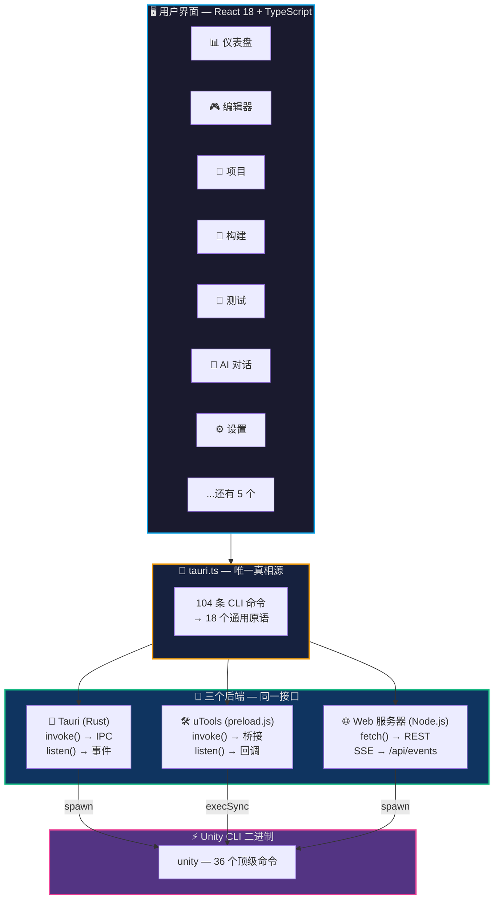
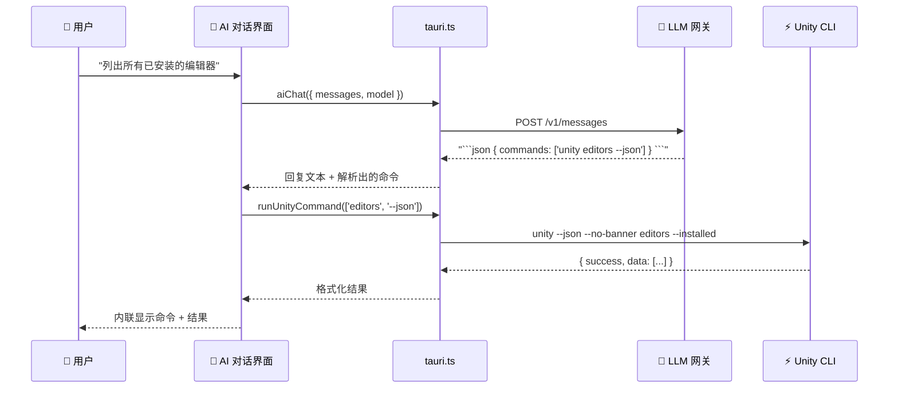
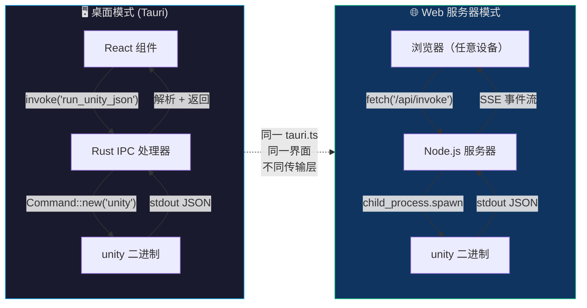
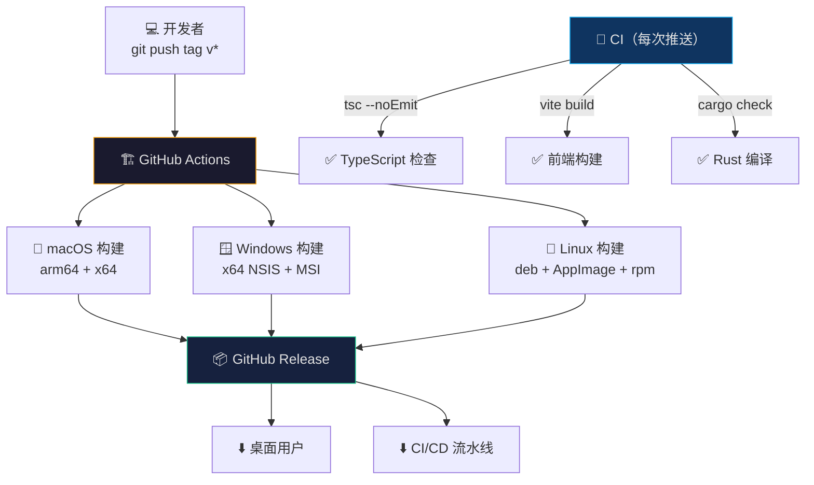

<div align="center">

# 🎮 Unity CLI GUI

### Unity 开发缺失的可视化指挥中心

Unity CLI 命令行工具的跨平台桌面 GUI —— 在一个精美的应用中管理编辑器、项目、构建、测试、许可证和 AI 自动化。

[](https://github.com/song-chaoyang/unity-cli-gui/actions/workflows/ci.yml)
[](https://github.com/song-chaoyang/unity-cli-gui/releases)
[](https://opensource.org/licenses/MIT)
[](https://github.com/song-chaoyang/unity-cli-gui/stargazers)
[](https://github.com/song-chaoyang/unity-cli-gui/releases)
[](https://tauri.app)
[](https://react.dev)
[](https://www.typescriptlang.org)

**macOS** · **Windows** · **Linux** · **Web 服务器** · **uTools**

[English](./README.md) | [中文文档](./README_zh.md)

</div>

---

## ✨ 功能特性

### 🖥️ 十二个内置页面

| 页面 | 描述 |
|:----:|------|
| 📊 **仪表盘** | 一目了然 —— 已安装编辑器、项目数量、运行中实例、缓存大小、最近活动 |
| 🎮 **编辑器** | 安装/卸载编辑器、管理模块、浏览版本、监控运行中实例 |
| 📁 **项目** | 可展开卡片，内联版本/目标切换、Git 信息、项目大小、搜索、排序、13+ 右键菜单操作 |
| 🔨 **构建** | 完整构建配置，实时日志流、搜索过滤、暂停/恢复、命令预览 |
| 🧪 **测试** | EditMode/PlayMode 测试运行器，实时结果和日志流 |
| 🤖 **MCP / AI** | 15+ AI 工具的 MCP 客户端配置、Pipeline 状态、自定义命令浏览器 |
| 💬 **AI 对话** | 自然语言 → Unity CLI 执行。自定义模型、MCP 服务、技能 —— 4 标签设置 |
| ⬇️ **下载** | 编辑器下载进度追踪，支持重试和取消 |
| 🖥️ **终端** | 内置终端（xterm.js），支持最大化模式 —— 无需外部终端 |
| 📋 **日志** | Unity Hub 活动日志查看器，支持跟随模式、搜索和过滤 |
| ⚙️ **设置** | 许可证、主题、语言、代理、缓存、CLI 更新、Hub 管理、诊断 |
| ℹ️ **关于** | 版本信息、更新检查、环境诊断、Bug 报告 |

### 🚀 核心亮点

- **AI 驱动自动化** —— 用自然语言与 Unity 环境对话。AI 将你的意图翻译为 CLI 命令并内联执行
- **三个构建目标，一份代码** —— 桌面（Tauri）、Web 服务器（Node.js）、uTools —— 通过 Vite 别名共享同一前端
- **104 条 CLI 命令封装** —— 每条 Unity CLI 命令都通过类型安全 API 访问。前端（`tauri.ts`）是唯一真相源，104 条命令映射到 18 个通用原语
- **10 种语言** —— English、简体中文、繁體中文、日本語、한국어、Deutsch、Español、Français、Português、Русский —— 自动检测系统语言
- **深色 / 浅色 / 跟随系统主题** —— 跟随系统偏好或手动覆盖
- **跨平台** —— macOS（Apple Silicon + Intel）、Windows、Linux 原生构建
- **无头 Web 服务器模式** —— 在远程服务器上运行，从任意浏览器访问。Linux/macOS/Windows 一键安装脚本
- **Git 集成** —— 每个项目卡片显示分支、仓库地址和提交状态
- **右键菜单力量** —— 每个项目 13+ 右键操作：打开、带参数打开、在文件管理器中显示、终端、代码编辑器、复制路径、设置、磁盘占用、升级、固定、移除、链接/断开云

### 🤖 AI 对话模块

通过自然语言控制 Unity：

| 能力 | 描述 |
|------|------|
| 自然语言 → CLI | 说 "列出所有已安装的编辑器" → 自动执行 `unity editors --installed` |
| 自定义模型 | 添加无限模型，每个模型独立 Base URL 和提供商 |
| MCP 服务 | 通过表单、JSON 粘贴或直接编辑文件配置第三方 MCP |
| 自定义技能 | 定义可复用的 AI 提示词模板 |
| 自动执行 | AI 回复中的命令自动执行，结果内联展示 |
| 自动保存 | 所有设置自动持久化 —— 无需保存按钮 |

---

## 📸 截图

<details open>
<summary><b>📊 点击展开截图</b></summary>

### 仪表盘


### 项目管理


### AI 对话


### 编辑器


### 构建与测试


### MCP / AI 集成


### 设置


</details>

---

## 🏗️ 架构

### 系统总览



### AI 对话工作流



### 请求流程 — 桌面端 vs Web 端



### 构建与发布流程



### 唯一真相源

前端 `tauri.ts` 定义了全部 104 条命令 → CLI 参数映射。三个后端各自只需实现 18 个通用原语：

| 原语 | Tauri (Rust) | uTools (preload.js) | Web (Node.js) |
|------|:---:|:---:|:---:|
| `runUnityJson` | ✅ `Command::new("unity")` | ✅ `child_process.execSync` | ✅ `child_process.spawn` |
| `runUnityPlain` | ✅ | ✅ | ✅ |
| `startStreaming` | ✅ `Child::spawn` + channels | ✅ `spawn` + callbacks | ✅ `spawn` + SSE |
| `aiChat` | ✅ `reqwest` | ✅ `fetch` | ✅ `fetch` |
| `readFileContent` | ✅ `std::fs` | ✅ `fs.readFileSync` | ✅ `fs.readFileSync` |
| `getGitInfo` | ✅ `Command::new("git")` | ✅ `child_process` | ✅ `child_process` |
| ...还有 12 个 | ✅ | ✅ | ✅ |

> **新增 Unity CLI 命令？** 在 `tauri.ts` 中添加一个函数即可。三个目标零后端改动。

---

## ⚡ 快速开始

### 桌面应用（开发）

```bash
git clone https://github.com/song-chaoyang/unity-cli-gui.git
cd unity-cli-gui
pnpm install
pnpm tauri dev
```

### 下载预构建二进制文件

前往 [Releases](https://github.com/song-chaoyang/unity-cli-gui/releases) 下载最新版本：

| 平台 | 文件 |
|------|------|
| macOS (Apple Silicon) | `.dmg` (arm64) |
| macOS (Intel) | `.dmg` (x64) |
| Windows | `.msi` / `.exe` (NSIS) |
| Linux | `.deb` / `.AppImage` / `.rpm` |

### Web 服务器模式（无头 / 远程）

一键安装 —— 适合 CI 机器和远程服务器：

```bash
# Linux / macOS
curl -fsSL https://raw.githubusercontent.com/song-chaoyang/unity-cli-gui/main/scripts/install-web.sh | sudo bash

# Windows（以管理员身份运行 PowerShell）
irm https://raw.githubusercontent.com/song-chaoyang/unity-cli-gui/main/scripts/install-web.ps1 | iex
```

安装完成后从任意浏览器访问：`http://<服务器IP>:8080`

---

## 🎯 前置要求

- [Node.js](https://nodejs.org/) v18+（推荐 v24）
- [pnpm](https://pnpm.io/) v9+
- [Rust](https://rustup.rs/) stable 工具链（仅桌面端）
- [Unity CLI](https://discussions.unity.com/threads/unity-cli.1640035/) 已安装并在 `PATH` 中

### 平台特定要求

| 平台 | 要求 |
|------|------|
| macOS | Xcode Command Line Tools |
| Windows | Microsoft Visual C++ Build Tools、WebView2 |
| Linux | `webkit2gtk-4.1`、`libgtk-3`、`libayatana-appindicator3` |

---

## ⌨️ 键盘快捷键

| 快捷键 | macOS | Windows / Linux | 操作 |
|:------:|:-----:|:---------------:|------|
| 设置 | `⌘ ,` | `Ctrl ,` | 打开设置页面 |
| 终端 | `⌘ T` | `Ctrl T` | 打开内置终端 |
| 刷新 | `⌘ R` | `Ctrl R` | 刷新当前页面数据 |
| 最大化 | `⌘ Shift M` | `Ctrl Shift M` | 最大化终端 / 日志面板 |

---

## 🛠️ 技术栈

| 层级 | 技术 | 原因 |
|------|------|------|
| **桌面框架** | [Tauri 2.0](https://tauri.app) | 比 Electron 更小的体积、更好的安全性 |
| **Web 服务器** | Node.js（`http` + SSE） | 零 npm 依赖，随处运行 |
| **前端** | React 18 + TypeScript | 类型安全 + 生态成熟 |
| **后端** | Rust (Tauri) / Node.js (Web) | 性能 + 安全 |
| **样式** | Tailwind CSS | 工具类优先，一致的设计 |
| **状态管理** | Zustand | 极简样板代码，无需 Provider 嵌套 |
| **终端** | xterm.js | 经过实战检验的终端模拟器 |
| **构建** | Vite 5 | 快速 HMR，优化的生产构建 |

---

## 🌐 国际化

10 种语言，实时切换 —— 无需重启：

| 🇺🇸 English | 🇨🇳 简体中文 | 🇹🇼 繁體中文 | 🇯🇵 日本語 | 🇰🇷 한국어 |
|:-----------:|:-----------:|:-----------:|:-----------:|:-----------:|
| 🇩🇪 Deutsch | 🇪🇸 Español | 🇫🇷 Français | 🇧🇷 Português | 🇷🇺 Русский |

首次启动时自动检测系统语言。

---

## 🚢 CI/CD

GitHub Actions 在标签推送（`v*`）时自动构建并发布全平台：

| 平台 | Runner | 架构 |
|------|--------|:----:|
| macOS | `macos-latest` | arm64 + x64 |
| Windows | `windows-latest` | x64 |
| Linux | `ubuntu-22.04` | x64 |

CI 在每次推送时运行：TypeScript 检查 + Vite 构建 + Rust `cargo check`。

---

## 🗺️ 路线图

- [x] 核心 12 个页面，完整 CLI 覆盖
- [x] AI 对话，自然语言 → CLI 执行
- [x] 10 种语言国际化，系统检测
- [x] 三个构建目标（Tauri / Web / uTools）
- [x] 深色 / 浅色 / 跟随系统主题
- [x] 无头 Web 服务器模式，一键安装
- [ ] 插件系统，支持自定义扩展
- [ ] 批量项目操作（多选）
- [ ] 构建历史与差异对比
- [ ] 项目配置云端同步
- [ ] 内置 Unity 包管理器 UI

---

## 🤝 贡献

欢迎贡献！无论是 Bug 报告、功能建议还是 Pull Request —— 每一份贡献都让这个项目更好。

1. Fork 本仓库
2. 创建功能分支：`git checkout -b feature/amazing-feature`
3. 提交更改：`git commit -m 'Add some amazing feature'`
4. 推送到分支：`git push origin feature/amazing-feature`
5. 提交 Pull Request

### 开发

```bash
pnpm install      # 安装依赖
pnpm tauri dev    # 启动开发服务器（热更新）
pnpm tauri build  # 构建生产二进制文件
pnpm dev:web      # 启动 Web 服务器开发模式
pnpm dev:utools   # 启动 uTools 开发模式
```

### 代码规范

- TypeScript 严格模式 —— 非绝对必要不用 `any`
- Rust clippy 零警告
- Tailwind 工具类 —— 非必要不写自定义 CSS
- i18n：所有用户可见字符串必须放入 `translations.ts`

---

## 📄 许可证

[MIT](LICENSE) © 2026 Unity CLI GUI Contributors

---

History

## ⭐ Star History

<a href="https://www.star-history.com/?repos=song-chaoyang%2Funity-cli-gui&type=date&legend=top-left">
 <picture>
   <source media="(prefers-color-scheme: dark)" srcset="https://api.star-history.com/chart?repos=song-chaoyang/unity-cli-gui&type=date&theme=dark&legend=top-left&sealed_token=bt0SHGhGK2TCOppKseQoCP3f-cORNLpU1U3UAHQyOUPAfQeA5usQPelMmV7rF80HY26WlhJgnaqpeRFhlfH8YAAr1CYpzZfSAMbVfOHrfhfiPr1VtDTV7QztJoWaXA1vVQ0istE6wIjM9wMBvb3b3PMcs5B_-x8bOcunxxzKPcQdO_mmHpyPPzHoEv3I" />
   <source media="(prefers-color-scheme: light)" srcset="https://api.star-history.com/chart?repos=song-chaoyang/unity-cli-gui&type=date&legend=top-left&sealed_token=bt0SHGhGK2TCOppKseQoCP3f-cORNLpU1U3UAHQyOUPAfQeA5usQPelMmV7rF80HY26WlhJgnaqpeRFhlfH8YAAr1CYpzZfSAMbVfOHrfhfiPr1VtDTV7QztJoWaXA1vVQ0istE6wIjM9wMBvb3b3PMcs5B_-x8bOcunxxzKPcQdO_mmHpyPPzHoEv3I" />
   
 </picture>
</a>

---

<div align="center">

**如果这个项目对你有帮助，给个 ⭐ 吧！**

用 ❤️ 为 Unity 社区打造

</div>
